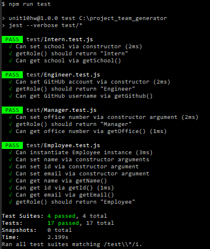

# Project Team Generator
    

    
[](https://github.com/chrisjmckeown/project_team_generator/blob/master/LICENSE)[](https://GitHub.com/chrisjmckeown/project_team_generator/graphs/contributors/)[](https://GitHub.com/chrisjmckeown/project_team_generator/pull/)
    
## Description
    
A webpage generator that displays a team's basic info so that you have quick access to emails and GitHub profiles. 
    
## Table of Contents
* [Installation](#Installation)
* [Usage](#Usage)
* [License](#License)
* [Contributing](#Contributing)
* [Tests](#Tests)
* [Questions](#Questions)

## Installation
1. Download and install [Node.js](http://nodejs.org/) (that will install npm as well)
2. Clone this repo
3. Install the dependancies.<br />
    ```
    npm install inquirer
    npm install jest
   ```
4. You are done for the setup, run the readme generator using 
    ```
    node index.js
   ``` 

### Technologies Utilized


   

## Usage
Once installed:
* Run the Project Team Generator using:
```
   node app.js
```
Below is the folder structure with folder descriptions:
```
lib/           // classes and helper code
output/        // rendered output
templates/     // HTML template(s)
test/          // jest tests
app.js
```

* When prompted, select from: 
    * Manager, to enter manager details
    * Engineer, to enter engineer details
    * Intern, to enter inter details
    * Team complete (exit), this will exit the CLI prompt to generate the HTML
* Check the "output" folder for generated team.

### Demonstration
Click to view the video:
[](https://drive.google.com/file/d/1i8v5VGjM_Tf2uhUgM3Bpje6rdlCbiOz-/view)

## License
 
[](https://github.com/chrisjmckeown/project_team_generator/blob/master/LICENSE)

## Contributing
Pull requests are welcome. For major changes, please open an issue first to discuss what you would like to change.

[](code_of_conduct.md)

## Tests
Complete the following to complete the jest tests.

```
npm run test
```

 

## Questions
    
* Follow me at: <a href="https://github.com/chrisjmckeown" target="_blank">https://github.com/chrisjmckeown</a>
    
* Please email with any question at: chris.j.mckeown@hotmail.com
    
© 2020 chrisjmckeown